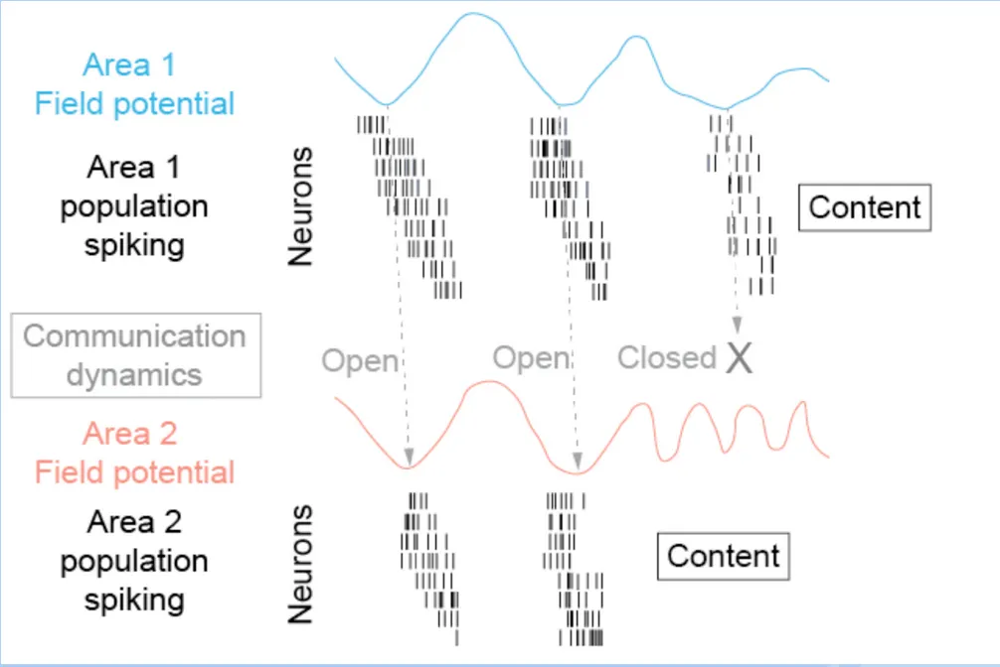

## Background and Motivation

Communication between different brain areas is important for performing any task whether it involves perception, cognition, or performing any action. The efficiency of this process impacts how different brain regions can coordinate and process information. The dominant theory is that communication is most effective when the phases between brain areas and field potentials (how neurons are excited) are aligned. So it relies on synchronized activity of different neural populations in the brain. And this synchronization is often observed as coherence.

The dominant theory is that communication is most effective when the phases between brain areas and field potentials (how neurons are excited) are aligned. So it relies on synchronized activity of different neural populations in the brain. This synchronization is often observed as coherence.

- An example is that different brain areas are radio stations and in order to hear another they need to be tuned to the same frequency. This tuning is the synchronization of electrical oscillations in different areas.

{: style="display:block; margin-left:auto; margin-right:auto; width:50%;"}

This theory, also referred to as Communication through Coherence (CTC), suggests that it may be possible that by modulating the coherence through stimulation that we could influence the communication between different brain regions, and thus cognitive or behavioral functions.

- According to CTC, when an upstream area sends information (in the form of neural spikes) during its high-excitability phase, and this coincides with a high-excitability phase in the downstream area, communication is most effective. If the phases don't align, the information may not be properly received or processed.

The idea we would want to implement is to sense field potential activity from one region and then adaptively make a new signal to generate coherence in the second region.

* This would be a closed-loop process as we measure field potential signals in real-time and use this information to generate a stimulation pattern for another region.  We then can dynamically boost or suppress coherence between regions without directly altering the content of neural activity.
* This system could potentially help restore functional connectivity in patients and have some therapeutic uses for people who may have conditions that disrupt communication between different regions.

## Algorithms

I tested a spectrum of approaches, those which included temporal, spatial, and hybrid approaches.
Here is a brief overview of some ot those methods:

### 1) Sine Subtraction

Sine subtraction is used to remove periodic artifacts from neural signals. It involves approximating the artifact as a sine wave at the stimulation frequency and then subtracting this sine wave from the recorded signal.

### 2) Template Subtraction

Template matching is a signal processing technique used to identify and remove artifacts from neural signals. 

It involves creating a reference template of the artifact and then subtracting this template from the affected signal. The main idea is to isolate the repeating artifact pattern, allowing us to clean the signal without distorting the underlying neural activity.

### 3) PCA (Principal Component Analysis)

Principal Component Analysis (PCA) is a statistical technique used to transform a set of observations of possibly correlated variables into a set of values of linearly uncorrelated variables called principal components. In the context of artifact rejection, PCA can be used to separate the artifact components from the true brain signal components based on their variance. We remove the top PCs which should correspond to the artifact. 

### 4) ICA (Independent Component Analysis)

Independent Component Analysis (ICA) is a computational technique for separating a multivariate signal into additive, independent components. We use it to separate out the artifact signals and the underlying neural data. 

Unlike PCA, which focuses on uncorrelated components, ICA focuses on statistically independent components.

- These are often components with distinct patterns or high amplitudes during the artifact periods. Set the identified artifact components to zero.
- ICA assumes components are Non-Gaussian and independent

Selecting which ICs correspond with an artifact is often done through a manual process. However for a real-time this much be automated with high accuracy. We use a combination of heuristics to evaluate which ones correspond to artifacts and which ones correspond to the underlying brain signal.

### 5) CSP (Common Spatial Pattern)

CSP learns spatial filters that maximize variance differences between two labeled conditions (stimulation vs non-stimulation). By projecting the multichannel signals into a CSP space, components that are consistently stronger during stimulation (often artifact-dominated) become isolated and can be attenuated or removed. This is helpful when the artifact is spatially structured but not perfectly captured by a single template or sinusoid.

### 6) Hybrid {Template Subtraction + ICA}

This hybrid approach first applies template subtraction to remove the large, repeatable portion of the stimulation artifact, then runs ICA on the residual to separate remaining artifact sources from neural activity.

### 7) Hybrid {Template Subtraction + PCA}

This hybrid approach first applies template subtraction to remove the large, repeatable portion of the stimulation artifact, then runs PCA on the residual to separate remaining artifact sources from neural activity.

### 8) Other (Wavelet, EMD, LRR, Adaptive Filtering)

Wavelet - We can decompose signal using a wavelet transform. Artifacts are assumed to be captured in the highest frequency detail coefficients Then we create a set of coefficients where some coefficients are set to zero or have a soft threshold applied and do the inverse transform.

EMD - EMD decomposes a signal into Intrinsic Mode Functions (IMFs). We then compare the dominant frequency of each IMF to the known artifact frequency. Afterwards we reconstruct the signal by summing all IMFs except the ones identified as containing artifacts.

LRR - This approach treats the the multichannel recording as a matrix and assume the stimulation artifact is a shared, structured component across channels, while true neural activity is more heterogeneous and can be modeled as a sparser or higher-rank residual. We solve a decomposition problem to separate the artifact subspace from the neural subspace, then reconstruct the cleaned signal from the non-artifact component.

Adaptive Filtering - Adaptive filtering models the artifact as something that can be predicted from a reference. An adaptive algorithm (commonly LMS or RLS) continuously updates filter weights to minimize the error between the contaminated signal and the filter’s artifact estimate. The estimated artifact is then subtracted from the raw signal, allowing the method to track non-stationary changes in artifact amplitude/phase over time. 

## Other Objectives

Apart from exploring algorithms and their effectiveness, this project also tries to explore and understand the temporal and frequency content of the neural signals, the signs of event markers, and how this information may be useful to create a closed-loop neuromodulation system. We also need to ensure that the methods attempted are robust and work across many different datasets and resistant to outliers. 