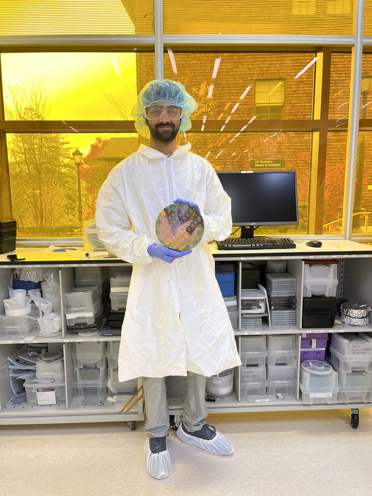

## Background

Over the semester, my lab group went through an end-to-end silicon process flow to build and test working devices on a single wafer. The flow combined **thin-film growth**, **lithography/alignment across multiple mask levels**, **wet chemical etching**, **dopant introduction + diffusion**, and **metallization**, followed by **electrical characterization** on a probe station.

We started with a 3 inch <100> p-type Si Substrate. The mask levels we used in the lab were **ACTV** (active area), **POLY** (gate), **CONT** (contacts), **METL** (metal interconnect).

## Process Flow

<table style="width: 100%; table-layout: fixed; text-align: center;">
  <tr>
    <th style="width: 15%;">Step</th>
    <th style="width: 30%;">Layer / Operation</th>
    <th style="width: 25%;">Goal</th>
    <th style="width: 30%;">Output</th>
  </tr>
  <tr>
    <td>1</td>
    <td>Field oxidation</td>
    <td>Grow thick isolation oxide</td>
    <td>Field oxide on wafer</td>
  </tr>
  <tr>
    <td>2</td>
    <td><strong>ACTV</strong> lithography + oxide etch</td>
    <td>Define active regions</td>
    <td>Exposed Si in actives</td>
  </tr>
  <tr>
    <td>3</td>
    <td>Gate oxidation</td>
    <td>Grow thin gate oxide</td>
    <td>Gate oxide (≈700–900 Å)</td>
  </tr>
  <tr>
    <td>4</td>
    <td>LPCVD doped polysilicon</td>
    <td>Deposit gate material</td>
    <td>~4000 Å poly-Si film</td>
  </tr>
  <tr>
    <td>5</td>
    <td><strong>POLY</strong> lithography + poly etch</td>
    <td>Pattern gates</td>
    <td>Poly gates + cleared S/D windows</td>
  </tr>
  <tr>
    <td>6</td>
    <td>Source/drain doping</td>
    <td>Introduce n-type dopant</td>
    <td>Doped S/D regions (pre-drive)</td>
  </tr>
  <tr>
    <td>7</td>
    <td>Drive-in + intermediate oxidation</td>
    <td>Activate/redistribute dopant; regrow oxide</td>
    <td>Intermediate oxide + set junctions</td>
  </tr>
  <tr>
    <td>8</td>
    <td><strong>CONT</strong> lithography + oxide etch</td>
    <td>Open contact holes</td>
    <td>Si/poly exposed at contacts</td>
  </tr>
  <tr>
    <td>9</td>
    <td>Al metallization</td>
    <td>Deposit metal film</td>
    <td>Blanket Al on wafer</td>
  </tr>
  <tr>
    <td>10</td>
    <td><strong>METL</strong> lithography + Al etch + sinter</td>
    <td>Pattern interconnect; improve contacts</td>
    <td>Completed devices ready to test</td>
  </tr>
</table>

 

{: style="display:block; margin-left:auto; margin-right:auto; width:50%;"}